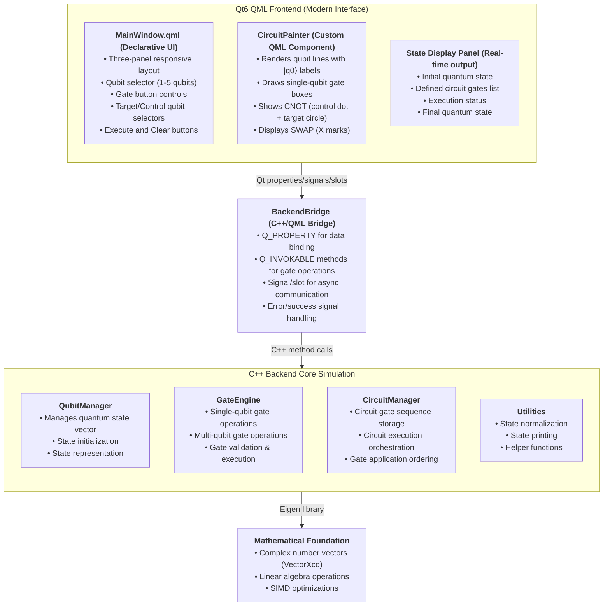
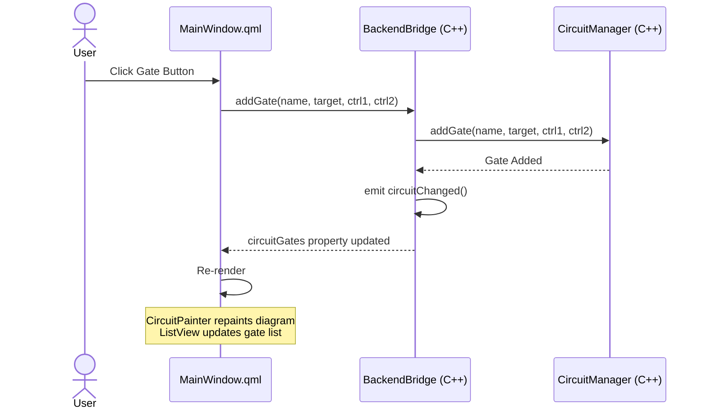
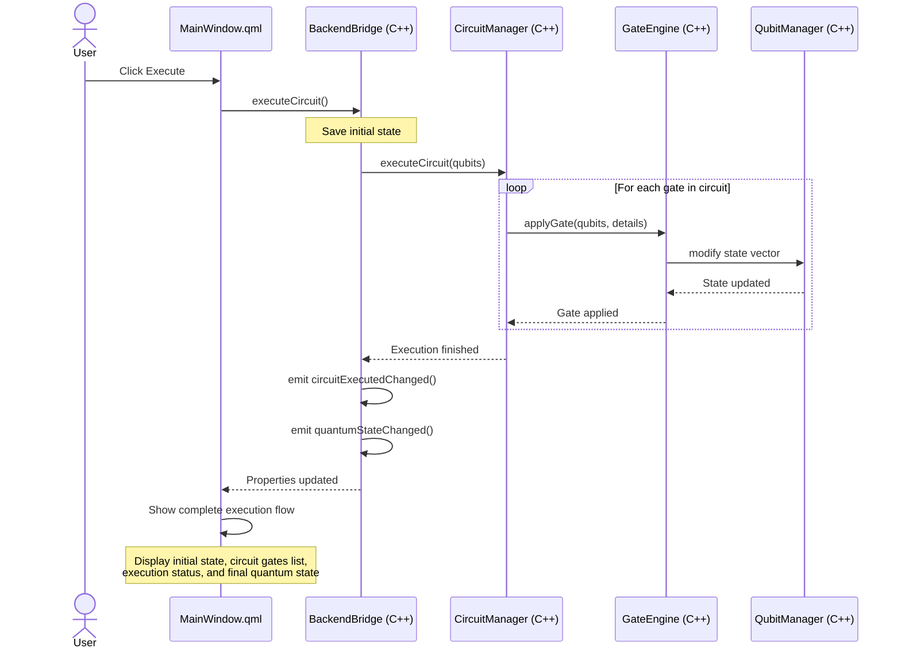

# System Architecture

This document describes the high-level architecture and design of the Quantum Circuit Simulator.

## Overview

The simulator follows a layered architecture with clear separation between backend (quantum simulation logic) and frontend (user interface).



## Component Details

### QubitManager
**Location**: `backend/src/qubit_manager.h/cpp`

Manages the quantum state representation and initialization.

**Key Responsibilities**:
- Store quantum state as complex vector (dimension: 2^n)
- Initialize to |00...0⟩ state
- Provide state access for gate operations
- Support custom initial state setup

**Key Methods**:
```cpp
QubitManager(int num_qubits);           // Constructor
void initializeZeroState();              // Set to |00...0⟩
Eigen::VectorXcd& getState();            // Get mutable state
const Eigen::VectorXcd& getState() const; // Get read-only state
int getNumQubits() const;                // Get qubit count
void setInitialState(const std::string&); // Initialize to binary state
```

### GateEngine
**Location**: `backend/src/gate_engine.h/cpp`

Implements quantum gate operations on the state vector.

**Single-Qubit Gates**:
- `applyPauliX(qubits, target)` - Bit flip gate
- `applyPauliY(qubits, target)` - Y-basis flip with phase
- `applyPauliZ(qubits, target)` - Phase flip gate
- `applyHadamard(qubits, target)` - Superposition creator

**Multi-Qubit Gates**:
- `applyCNOT(qubits, control, target)` - Controlled-NOT for entanglement
- `applySWAP(qubits, qubit1, qubit2)` - Exchange qubit states
- `applyToffoli(qubits, ctrl1, ctrl2, target)` - Controlled-controlled-NOT

**Implementation Pattern**:
1. Validate qubit indices
2. Get state vector reference
3. Iterate through all basis states
4. Apply gate transformation (bit manipulations + phase modifications)
5. Update state vector

### CircuitManager
**Location**: `backend/src/circuit_manager.h/cpp`

Orchestrates circuit execution by sequencing gate operations.

**Key Responsibilities**:
- Store gate sequence
- Execute gates in order on QubitManager
- Provide circuit visualization data
- Handle gate name translation

**Key Methods**:
```cpp
void addGate(const std::string& name, int target, 
             int control1=-1, int control2=-1); // Add gate to circuit
void executeCircuit(QubitManager& qubits);      // Execute all gates
void printCircuit() const;                       // Print circuit info
```

### Frontend Components

#### MainWindow
**Location**: `frontend/src/mainwindow.h/cpp`

Main GUI window managing all user interactions.

**Responsibilities**:
- Gate button creation and layout
- Qubit count selection
- Circuit execution triggers
- Results display

#### CircuitView
**Location**: `frontend/src/circuit_view.h/cpp`

Custom Qt widget for visual circuit representation.

**Responsibilities**:
- Draw qubit lines
- Draw gate boxes
- Provide gate drag-and-drop (future)
- Translate GUI names to backend names

#### ResultsWindow
**Location**: `frontend/src/results_window.h/cpp`

Displays quantum simulation results.

**Responsibilities**:
- Show state amplitudes
- Display probabilities
- Format output for readability

## Data Flow

### Execution Flow (CLI)
```
1. QubitManager(5) -> Create 5-qubit system in |00000⟩
2. CircuitManager.addGate("H", 0) -> Queue Hadamard on qubit 0
3. CircuitManager.addGate("CNOT", 0, 1) -> Queue CNOT
4. CircuitManager.executeCircuit(qubits) -> Run all gates
5. Print final state
```

### Execution Flow (GUI)
```
1. User selects qubit count -> QubitManager created
2. User clicks "Hadamard" button -> CircuitView.addGate()
3. User selects target qubit -> GateEngine queued
4. User clicks "Execute" -> CircuitManager.executeCircuit()
5. Results displayed in ResultsWindow
```

## State Vector Representation

For an n-qubit system, the state vector has 2^n elements:

```
State |ψ⟩ = Σ(i=0 to 2^n-1) α_i |i⟩

Where:
- n = number of qubits
- α_i = complex amplitude at basis state i
- |i⟩ = basis state (binary representation)
- α_i is stored at state(i) in Eigen::VectorXcd
```

### Qubit Ordering
- Little-endian convention
- Qubit 0 is least significant bit (rightmost)
- Index i represents binary string: bit0, bit1, bit2, ...

Example for 3 qubits:
```
state(0) = |000⟩
state(1) = |100⟩ (qubit 0 = 1)
state(2) = |010⟩ (qubit 1 = 1)
state(4) = |001⟩ (qubit 2 = 1)
```

## Gate Implementation Pattern

All gates follow a standard pattern:

```cpp
void GateEngine::applyGateName(QubitManager& qubits, int target) {
    // 1. Validate indices
    validateQubitIndex(qubits, target);
    
    // 2. Get state reference
    Eigen::VectorXcd& state = qubits.getState();
    int dimension = state.size();
    
    // 3. Create new state (if needed for complex operations)
    Eigen::VectorXcd new_state = state;
    
    // 4. Apply transformation to each basis state
    for (int i = 0; i < dimension; ++i) {
        // Check if target qubit is 0 or 1
        if ((i >> target) & 1) {
            // Manipulate state accordingly
            // Use bitwise operations for efficiency
        }
    }
    
    // 5. Update state if needed
    state = new_state;
}
```

## Frontend Architecture (QML/Qt Quick)

### Overview
The modern QML frontend provides a declarative, responsive interface for quantum circuit design and visualization.

### Key Components

#### MainWindow.qml
**Purpose**: Main application container and layout

**Structure**:
- **Header**: Application title with integrated qubit selector (1-5 range)
- **Three-Panel Layout**:
  1. **Left Panel**: Gate control buttons
     - Single-qubit gates (H, X, Y, Z) with target qubit selector
     - Multi-qubit gates (CNOT, SWAP) with control/target selectors
     - Execute and Clear buttons
  2. **Center Panel**: Circuit visualization (split view)
     - Top: CircuitPainter custom component showing qubit lines and gate symbols
     - Bottom: ListView displaying gate sequence list
  3. **Right Panel**: Execution flow display
     - Scrollable text showing initial state, circuit definition, execution status, final state

**Properties**:
- Binds to `backend.qubitCount`, `backend.circuitGates`, `backend.quantumState`
- Listens for `backend.executionError` signal
- Shows success/error messages with auto-hide timers

**Color Scheme** (Catppuccin Dark):
- Background: `#1e1e2e`
- Accent: `#89b4fa`
- Panels: `#313244`
- Text: `#cdd6f4`

#### CircuitPainter (Custom QML Type)
**File**: `circuit_painter.h/cpp`

**Purpose**: Custom QQuickPaintedItem for rendering quantum circuit diagrams

**Rendering Features**:
- Draws horizontal qubit lines with labels (|q0⟩, |q1⟩, etc.)
- Single-qubit gates: Colored boxes with gate names
- CNOT gates: Control dot on control qubit, target circle + plus on target qubit
- SWAP gates: X marks on both qubits
- Spacing constants: `GATE_SPACING=80`, `QUBIT_SPACING=60`

**Data Binding**:
- Q_PROPERTY `qubitCount`: Bound to backend qubit count
- Q_PROPERTY `gates`: QStringList of gate descriptions

**Gate Parsing**:
- Uses QRegularExpression to parse gate strings
- Supports formats: "H(q0)", "CNOT(ctrl=0, target=1)", "SWAP(q3 <-> q4)"

#### BackendBridge (C++/QML Bridge)
**File**: `backend_bridge.h/cpp`

**Purpose**: Exposes C++ quantum backend to QML layer

**Q_PROPERTY Bindings** (for automatic UI updates):
- `qubitCount`: Current number of qubits
- `quantumState`: Formatted final quantum state
- `initialState`: Initial state before circuit execution
- `circuitDescription`: Summary of circuit
- `circuitGates`: QStringList of gate descriptions
- `circuitExecuted`: Boolean tracking execution state

**Q_INVOKABLE Methods** (callable from QML):
- `setQubitCount(int)`: Change qubit count
- `setInitialState(QString)`: Set initial binary state
- `addGate(QString, int, int, int)`: Add gate to circuit
- `executeCircuit()`: Run circuit simulation
- `clearCircuit()`: Reset circuit and state
- `getAvailableQubits()`: Return qubit indices

**Signal Emissions**:
- `quantumStateChanged()`: When state updates
- `initialStateChanged()`: When initial state changes
- `circuitChanged()`: When circuit gates change
- `circuitExecutedChanged()`: When execution state changes
- `executionError(QString)`: On errors
- `executionSuccess()`: On successful execution

### Data Flow

#### Gate Addition Flow



#### Circuit Execution Flow



### Resource Management

#### resources.qrc
Qt resource file for embedding QML and assets. Currently configured for filesystem loading during development, can be switched to embedded resources for production.

#### Build Integration
- CMakeLists.txt finds Qt6 Qml and Quick modules
- Qt AutoMOC generates moc files for Q_OBJECT classes
- Qt RCC compiles resources.qrc
- Main executable links Qt6::Qml and Qt6::Quick libraries

## Performance Characteristics

### Time Complexity
- Single-qubit gate: O(2^n) - must iterate all basis states
- Multi-qubit gate: O(2^n) - same as single-qubit
- Circuit execution: O(m × 2^n) where m = number of gates

### Space Complexity
- State storage: O(2^n) complex numbers
- For 5 qubits: 32 × 16 bytes = 512 bytes
- For 10 qubits: 1024 × 16 bytes = 16 KB

### Practical Limits
- Current: 5 qubits (32 states) - fast execution
- Feasible: 8-10 qubits (1K-1M states) - acceptable memory
- Not feasible: 20+ qubits - exponential growth

## Design Decisions

### Why Eigen?
- Highly optimized linear algebra
- Built-in SIMD support
- Complex number support
- Minimal dependencies

### Why No Sparse Matrices?
- For small systems, overhead > benefit
- Dense representation faster for <10 qubits
- Sparse needed only for 15+ qubits

### Why Little-Endian Qubit Ordering?
- Aligns with bitwise operations
- Natural for bit-flip indices: `i ^ (1 << target)`
- Efficient qubit state checking: `(i >> target) & 1`

## Future Extensibility

The architecture supports easy addition of:
- New gate types (add method to GateEngine)
- Measurement operations (extend GateEngine)
- Circuit optimization passes (add to CircuitManager)
- Custom gate definitions (extend addGate interface)
- State visualization (extend ResultsWindow)
